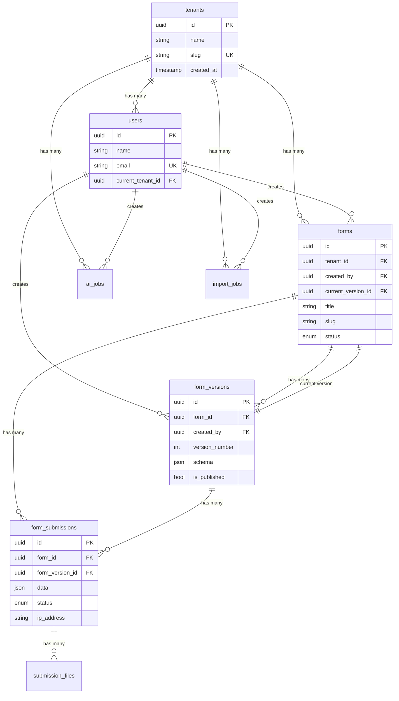
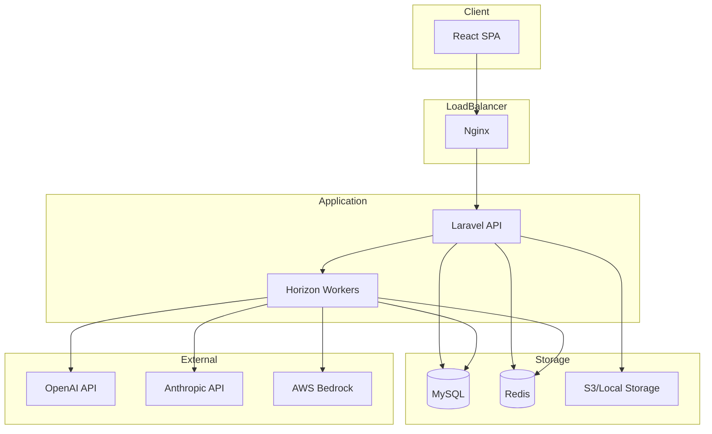
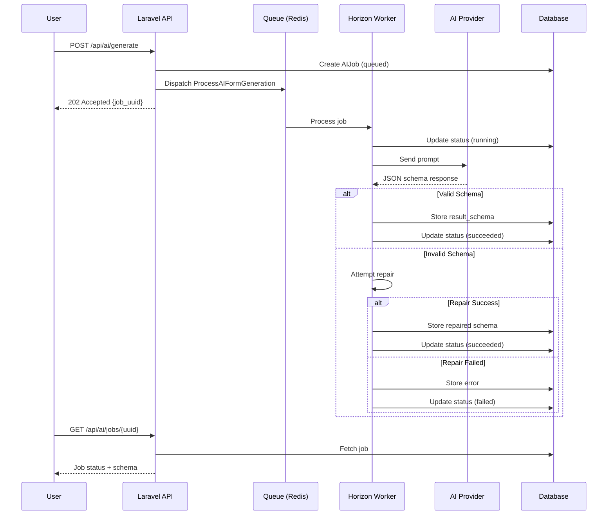
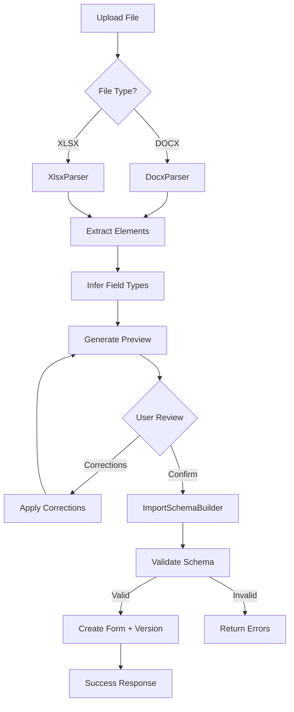

# DECISIONS.md - Phase 6 & 7

## Phase 6: Form Versioning & Conditional Logic

### Feature 1: Form Versioning

### User Problem
Form creators need to track changes over time, compare versions, and safely rollback to previous states without losing data. Submissions must always reference the exact form version used at submission time for data integrity and compliance.

### Implementation

**Immutable Versions**
- Each schema change creates a new FormVersion record
- Published versions are marked immutable (`is_published = true`)
- Version numbers auto-increment per form
- Schema version tracks format compatibility

**Version Metadata**
- `version_number`: Sequential integer per form
- `schema_version`: Schema format version (e.g., "1.0")
- `change_type`: created | updated | published | restored
- `change_summary`: JSON with counts of added/removed/modified fields/sections
- `created_by`: User who created the version
- `restored_from_version_id`: Links rollback versions to source

**Rollback Strategy**
```
Old Version (v1) → Rollback → New Version (v3)
                              └── schema copied from v1
                              └── restored_from_version_id = v1.id
                              └── change_type = 'restored'
```
Rollback NEVER mutates old versions. It creates a NEW version with the old schema.

**Version Comparison**
- Field-level diff: added, removed, modified
- Section-level diff: added, removed, modified
- Settings diff
- Tracks specific property changes (label, validation, options, conditions)

**Submission Integrity**
- Each submission stores `form_version_id`
- Submissions always reference exact schema used
- Historical submissions viewable with original field structure

### Alternatives Considered

1. **Mutable versions with audit log**: Simpler but loses exact schema state
2. **Git-style branching**: Too complex for form use case
3. **Snapshot on publish only**: Loses draft history

### Trade-offs

| Approach | Pros | Cons |
|----------|------|------|
| Immutable versions | Full history, safe rollback | More storage |
| Copy-on-rollback | Never loses data | Version numbers can grow |
| JSON diff | Human-readable changes | Complex nested comparison |

### Limitations

- No merge capability for concurrent edits
- No partial rollback (field-level)
- Change summary is count-based, not semantic
- Large schemas increase storage

### Two Additional Weeks Would Add

1. **Visual diff viewer**: Side-by-side schema comparison in UI
2. **Partial rollback**: Restore specific fields/sections only
3. **Version branching**: Create variants from any version
4. **Diff annotations**: Comments on why changes were made
5. **Version tagging**: Named versions (e.g., "v2.0 Release")
6. **Automated changelog**: Generate release notes from diffs

---

## Feature 2: Conditional Logic

### User Problem
Form creators need dynamic forms that adapt based on user input:
- Show/hide fields based on answers
- Make fields required conditionally
- Skip sections based on responses
- Create branching survey flows

### Implementation

**Condition Structure**
```typescript
interface Condition {
  action: 'show' | 'hide' | 'require' | 'skip_to_section' | 'skip_to_step';
  field: string;      // Target field key to evaluate
  operator: string;   // Comparison operator
  value?: unknown;    // Value to compare against
  targetSection?: string; // For skip actions
}
```

**Supported Operators by Field Type**

| Field Type | Operators |
|------------|-----------|
| text, textarea, email | equals, not_equals, contains, not_contains, is_empty, is_not_empty |
| number, rating | equals, not_equals, greater_than, less_than, >=, <=, is_empty, is_not_empty |
| select | equals, not_equals, in, not_in, is_empty, is_not_empty |
| checkbox | equals, is_checked, is_not_checked |
| checkbox_group | contains, not_contains, is_empty, is_not_empty |
| file | is_empty, is_not_empty |

**Validation Rules**
1. Referenced field must exist
2. Operator must be compatible with field type
3. No self-reference (field cannot depend on itself)
4. No backward skip (prevents infinite loops)
5. Target section must exist for skip actions
6. Option values must be valid for select/radio fields

**Shared Evaluation Logic**
- `ConditionEvaluator` class in PHP and TypeScript
- Same logic for preview, public renderer, and server validation
- Caches visibility results for performance

**Hidden Field Behavior**
- Hidden fields skip required validation
- Hidden sections skip all field validation
- Server re-evaluates all conditions (never trusts client)

### Alternatives Considered

1. **Expression language**: More powerful but harder to validate
2. **Visual flow builder**: Better UX but complex implementation
3. **Rule engine**: Overkill for form conditions

### Trade-offs

| Approach | Pros | Cons |
|----------|------|------|
| Declarative conditions | Easy to validate, serialize | Limited expressiveness |
| Per-field conditions | Simple mental model | Can't express OR logic |
| Type-specific operators | Prevents invalid comparisons | More code to maintain |

### Limitations

- No OR logic (all conditions are AND)
- No nested conditions
- No computed/calculated fields
- No cross-section field references for skip
- Cycle detection is basic (direct only)

### Two Additional Weeks Would Add

1. **OR/AND groups**: Complex condition combinations
2. **Calculated fields**: Derive values from other fields
3. **Visual condition builder**: Drag-drop flow editor
4. **Condition templates**: Reusable condition patterns
5. **Advanced cycle detection**: Full graph traversal
6. **Condition testing**: Simulate different input scenarios
7. **Condition analytics**: Track which paths users take

---

## API Endpoints

### Versioning
```
GET    /api/forms/{form}/versions              # List version history
GET    /api/forms/{form}/versions/{version}    # Get version details
POST   /api/forms/{form}/versions/compare      # Compare two versions
POST   /api/forms/{form}/versions/{version}/rollback  # Rollback to version
POST   /api/forms/{form}/versions/{version}/publish   # Publish version
```

### Condition Validation
Conditions are validated as part of schema validation when:
- Creating/updating form schema
- Publishing form

---

## Test Coverage

### Versioning Tests (18 tests)
- Version creation and numbering
- Immutability after publish
- Change summary generation
- Rollback creates new version
- Rollback doesn't mutate old version
- Version comparison (fields, sections, settings)
- API endpoints
- Submission version integrity

### Conditional Logic Tests (22 tests)
- Field reference validation
- Operator compatibility
- Self-reference rejection
- Skip target validation
- Backward skip cycle rejection
- Option value validation
- Runtime evaluation (show, hide, equals, greater_than, contains, is_empty)
- Conditional require
- Hidden required field behavior
- Section visibility cascading
- Operator support by field type


---

## Phase 7: AI Form Generation and Editing

### User Problem
Form creators want to quickly generate forms from natural language descriptions and modify existing forms using plain English instructions, without manually configuring each field.

### AI Provider Strategy

**Abstraction Layer**
```php
interface FormAIProvider {
    public function generateForm(string $prompt, array $options = []): AIResponse;
    public function modifyForm(array $currentSchema, string $instruction, array $options = []): AIResponse;
    public function getProviderName(): string;
    public function getModelName(): string;
    public function isAvailable(): bool;
}
```

**Provider Implementations**
- `OpenAIProvider`: Production provider using GPT-4o-mini
- `MockAIProvider`: Deterministic responses for testing

**Configuration**
```env
AI_PROVIDER=openai
OPENAI_API_KEY=sk-...
OPENAI_MODEL=gpt-4o-mini
OPENAI_TIMEOUT=60
OPENAI_MAX_TOKENS=4096
```

### System Prompt Strategy

**Generation Prompt**
- Defines schema version and supported field types
- Provides complete output format with examples
- Lists field-specific properties (min, max, options, etc.)
- Enforces rules: unique IDs, snake_case keys, logical sections
- Requests JSON-only output (no markdown)

**Modification Prompt**
- Instructs to preserve existing IDs and keys
- Only modify what is requested
- Output complete modified schema
- Preserve field order unless reordering requested

### Output Contract

AI must return valid JSON conforming to schema version 1.0:
```json
{
  "schemaVersion": "1.0",
  "metadata": { "title": "...", "description": "..." },
  "settings": { "submitButtonText": "Submit", ... },
  "sections": [
    {
      "id": "section_unique",
      "title": "Section Title",
      "fields": [
        { "id": "field_unique", "key": "field_key", "type": "text", "label": "Label" }
      ]
    }
  ]
}
```

### Validation & Repair

**Validation Pipeline**
1. Parse JSON (handle markdown-wrapped, extract from content)
2. Validate against FormSchemaContract
3. If invalid, attempt repair
4. Re-validate after repair
5. Only persist if valid

**Repair Capabilities**
- Fix schema version
- Add missing metadata/settings
- Generate missing IDs and keys
- Fix duplicate IDs/keys
- Map unsupported field types (dropdown→select, boolean→checkbox)
- Add default options for select/radio fields
- Fix min/max constraint inversions
- Remove unsupported properties
- Cap file sizes to reasonable limits

**Field Type Mapping**
| AI Output | Mapped To |
|-----------|-----------|
| string, input, textfield | text |
| dropdown, choice | select |
| boolean, toggle | checkbox |
| checkboxes | checkbox_group |
| attachment, document | file |

### Retry/Repair Behavior

**Retryable Errors**
- Timeout (3 retries, exponential backoff)
- Rate limit (3 retries)
- Provider error (3 retries)

**Non-Retryable Errors**
- Authentication failure
- Invalid JSON after parse attempts
- Schema validation failure after repair

**Bounded Retry**
- Max 3 attempts per job
- Backoff: 10s, 20s, 30s
- Job timeout: 120s

### Security

**Never Log**
- API keys or secrets
- Bearer tokens
- Unnecessary PII from submissions

**Sanitization**
- Error messages: redact API keys, tokens
- Prompts: replace emails, phones, SSNs with placeholders
- Job records: store sanitized prompt only

**Tenant Isolation**
- Jobs scoped to tenant_id
- Cannot access other tenant's jobs
- Form modifications require authorization

### Observability

**AIJob Record**
```
- job_uuid: Unique identifier
- tenant_id, user_id, form_id
- request_type: generate | modify
- status: queued | running | succeeded | failed
- provider, model
- prompt (sanitized)
- result_schema (on success)
- validation_errors, repair_log
- input_tokens, output_tokens, latency_ms
- error_type, error_message (sanitized)
- timestamps
```

**Metrics Tracked**
- Token usage (input/output)
- Latency (ms)
- Retry count
- Validation outcome
- Repair actions taken

### Diff Workflow

**Never Directly Overwrite**
```
Current Schema
    ↓
AI Modification
    ↓
Validate & Repair
    ↓
Generate Diff (added/removed/modified fields)
    ↓
User Reviews Diff
    ↓
Accept → Create NEW Version
Reject → Discard
```

### API Endpoints

```
POST /api/ai/generate           # Queue form generation
POST /api/ai/forms/{id}/modify  # Queue form modification
GET  /api/ai/jobs/{uuid}        # Get job status
GET  /api/ai/jobs               # List user's jobs
POST /api/ai/forms/{id}/preview-diff  # Preview changes
POST /api/ai/forms/{id}/accept  # Accept AI changes
POST /api/ai/create-form        # Create form from generation
GET  /api/ai/provider           # Get provider info
```

### Limitations

1. **No streaming**: Responses are complete, not streamed
2. **Single provider**: One active provider at a time
3. **No conversation**: Each request is independent
4. **English-centric prompts**: System prompts in English
5. **No image understanding**: Text prompts only
6. **Schema v1.0 only**: No multi-version support
7. **No cost estimation**: Token usage tracked but not priced

### Two Additional Weeks Would Add

1. **Streaming responses**: Show generation progress
2. **Multi-turn conversation**: Refine forms iteratively
3. **Provider fallback**: Auto-switch on failure
4. **Cost tracking**: Estimate and track API costs
5. **Prompt templates**: Reusable generation templates
6. **Field suggestions**: AI suggests fields based on context
7. **Smart defaults**: Learn from user's previous forms
8. **Batch generation**: Generate multiple form variants
9. **A/B testing**: Compare AI-generated vs manual forms
10. **Fine-tuning**: Custom model for form generation

---

## Test Coverage Summary

### Phase 6 Tests (40 tests)
- VersioningTest: 18 tests
- ConditionalLogicTest: 22 tests

### Phase 7 Tests (29 tests)
- Generation workflow
- Prompt validation
- Schema validation and repair
- Field type mapping
- Error handling (timeout, rate limit, auth)
- AI editing (modify, translate, add fields)
- Version creation on accept
- Job status tracking
- Token/latency metrics
- Security (sanitization, tenant isolation)
- Diff preview

### Total: 211 tests, 514 assertions


---

## Phase 8: Word and Excel Form Import

### User Problem
Form creators often have existing forms in Word documents or Excel spreadsheets that they want to convert to digital forms. Manual recreation is time-consuming and error-prone.

### Import Strategy

**Deterministic First, AI Second**
- All parsing is deterministic by default
- AI classification only used for genuinely ambiguous cases
- Predictable, testable behavior

### DOCX Import

**Supported Patterns**
| Document Element | Detected As |
|-----------------|-------------|
| Headings (H1-H6) | Section breaks |
| Text ending with `:` or `?` | Questions/fields |
| Bullet/numbered lists | Choice options (radio/select) |
| Checkbox lists (☐, [], etc.) | Checkbox group options |
| Underscores `___` | Text input placeholders |
| Tables with Q&A structure | Structured question groups |

**Field Type Inference**
| Text Pattern | Inferred Type |
|--------------|---------------|
| email, e-mail | email |
| phone, telephone, mobile | phone |
| date, birthday, dob | date |
| number, amount, age | number |
| url, website, link | url |
| describe, explain, message | textarea |
| yes/no, agree, consent | checkbox |
| rate, rating, score | rating |
| Default | text |

**Security**
- Never execute macros or embedded content
- Validate MIME type and extension
- Max file size: 10MB
- Sanitize all extracted text

### XLSX Import

**Two Formats Supported**

1. **Header Row Format** (simple)
```
Name | Email | Phone | Age
John | john@example.com | 555-1234 | 30
```
- Column headers become field labels
- Sample data used to infer types

2. **Mapping Format** (explicit)
```
section | field_type | key | label | placeholder | help_text | required | options | validation
Personal | text | name | Full Name | Enter name | | yes | | minLength:2
```
- Full control over field configuration
- Options as `value:label,value:label`
- Validation as `min:18,max:120`

**Type Inference from Samples**
- Email: Valid email format
- Phone: 7+ digits with optional formatting
- Date: Common date patterns (YYYY-MM-DD, MM/DD/YYYY)
- Number: Numeric values
- URL: Valid URL format
- Default: text (for ambiguous values)

### Import Workflow

```
Upload File
    ↓
Validate (extension, MIME, size, tenant)
    ↓
Queue if large (>1MB) or process sync
    ↓
Deterministic Parse
    ↓
[Optional] AI Classification (for ambiguous)
    ↓
Schema Validation
    ↓
Preview (show parsed elements)
    ↓
User Corrections (modify labels, types, options)
    ↓
Confirm
    ↓
Create Form + Version (atomic)
```

**Atomic Commit**
- Import failure NEVER creates partial form
- All-or-nothing transaction
- File cleaned up on success or failure

### Preview Display

Each parsed element shows:
- Source text (original document content)
- Detected section
- Detected field type
- Generated label and key
- Options (for choice fields)
- Validations
- Warnings (ambiguous parsing)
- Parseable flag (false for unparseable blocks)

### Correction API

Users can correct before commit:
```json
{
  "corrections": [
    { "index": 0, "label": "Full Name", "key": "full_name" },
    { "index": 1, "detected_field_type": "email" }
  ]
}
```

### Queue Strategy

**Sync Processing** (< 1MB)
- Immediate parsing
- Response includes parsed elements

**Async Processing** (≥ 1MB)
- Job queued
- Status polling via API
- 3 retries, 120s timeout

### ImportJob Model

```
- job_uuid: Unique identifier
- tenant_id, user_id, form_id
- import_type: docx | xlsx
- status: queued | running | parsed | succeeded | failed
- original_filename, file_path, file_size
- parsed_elements: JSON array of ParsedElement
- corrected_elements: User-modified elements
- result_schema: Final form schema
- validation_errors, warnings
- error_message
- use_ai_classification: boolean
- timestamps
```

### API Endpoints

```
POST   /api/import/upload           # Upload and start import
GET    /api/import                  # List import jobs
GET    /api/import/{uuid}           # Get job status
GET    /api/import/{uuid}/preview   # Get parsed elements
POST   /api/import/{uuid}/correct   # Apply corrections
POST   /api/import/{uuid}/commit    # Create form from import
DELETE /api/import/{uuid}           # Cancel import
```

### Limitations

1. **No macro execution**: VBA/macros ignored for security
2. **No embedded objects**: Images, charts not processed
3. **No complex tables**: Merged cells may not parse correctly
4. **No form controls**: Word form fields not detected
5. **Single sheet**: Only active sheet processed for Excel
6. **No formulas**: Excel formulas evaluated as values
7. **English patterns**: Type inference optimized for English

### Two Additional Weeks Would Add

1. **AI-assisted classification**: Use AI for ambiguous elements
2. **Multi-sheet support**: Import from multiple Excel sheets
3. **Template detection**: Recognize common form templates
4. **Batch import**: Import multiple files at once
5. **Import history**: Track and re-import from history
6. **Field mapping UI**: Visual drag-drop field mapping
7. **Preview rendering**: Show form preview before commit
8. **Import from URL**: Fetch documents from URLs
9. **PDF import**: Parse PDF forms
10. **Google Docs/Sheets**: Direct integration

---

## Test Coverage Summary

### Phase 8 Tests (24 tests)

**DocxImportTest (8 tests)**
- Basic document parsing
- Question detection
- Email/phone type inference
- List parsing (choice/checkbox)
- Table parsing
- Invalid file rejection
- Title extraction

**XlsxImportTest (8 tests)**
- Header row format parsing
- Mapping format parsing
- Type inference from samples
- Ambiguous value handling
- Invalid file rejection
- Options parsing
- Validation rules parsing
- Title inference from filename

**ImportWorkflowTest (8 tests)**
- Schema builder creates valid schema
- Heading-based section grouping
- Options preservation
- Failed import no partial form
- Job status transitions
- Corrections workflow
- Unique key generation
- Default options for select fields

### Total: 265 tests, 622 assertions

---

## Phase 9: Security Hardening & Performance

### Security Measures Implemented

1. **Authorization Hardening**
   - FormPolicy enforces tenant ownership
   - Cross-tenant access blocked at controller level
   - File downloads require authenticated tenant member

2. **Rate Limiting**
   - Public submissions: 10/minute per IP
   - Authentication: 5/minute per IP
   - AI generation: 5/minute per user
   - AI modification: 10/minute per user
   - Document import: 5/5 minutes per user
   - CSV export: 10/minute per user

3. **Input Validation**
   - Schema size limit: 1MB
   - Max fields: 200
   - Max sections: 50
   - Max options: 500
   - Regex pattern safety validation
   - AI prompt length limit: 5000 chars

4. **File Security**
   - Blocked extensions: php, exe, bat, sh, etc.
   - Double extension detection
   - MIME type validation
   - Path traversal prevention
   - Null byte sanitization

5. **CSV Injection Prevention**
   - Formula characters escaped with single quote
   - Affects: =, +, -, @, |, %

### Performance Optimizations

1. **Database Indexes**
   - forms: (tenant_id, updated_at), (slug, status)
   - form_versions: (form_id, version_number), (form_id, is_published)
   - form_submissions: (form_id, ip_address, submitted_at)
   - ai_jobs: (tenant_id, user_id, created_at)
   - import_jobs: (job_uuid, tenant_id)

2. **Query Optimization**
   - Eager loading for relationships
   - Pagination for list endpoints
   - Selective column loading

---

## Architecture Diagrams

### Entity Relationship Diagram



### System Architecture



### AI Generation Sequence



### Import Flow



---

## Two-Week Improvement Plan

If given two additional weeks, the following improvements would be prioritized:

### Week 1: User Experience

1. **Visual Condition Builder** (3 days)
   - Drag-drop interface for creating conditions
   - Visual flow diagram showing field dependencies
   - Condition testing/simulation mode

2. **Form Templates** (2 days)
   - Pre-built templates (Contact, Survey, Registration)
   - Save custom forms as templates
   - Template marketplace/sharing

3. **Real-time Collaboration** (2 days)
   - WebSocket-based live updates
   - Presence indicators
   - Conflict resolution

### Week 2: Features & Polish

4. **Analytics Dashboard** (2 days)
   - Submission trends over time
   - Field completion rates
   - Drop-off analysis
   - Export reports

5. **Webhook Notifications** (1 day)
   - Configurable webhooks per form
   - Retry logic with exponential backoff
   - Webhook logs and debugging

6. **Internationalization** (2 days)
   - Multi-language form labels
   - RTL support
   - Date/number formatting

7. **PDF Export** (1 day)
   - Export submissions as PDF
   - Customizable templates
   - Batch export

8. **Testing & Documentation** (1 day)
   - E2E tests with Playwright
   - API documentation with OpenAPI
   - Video tutorials
