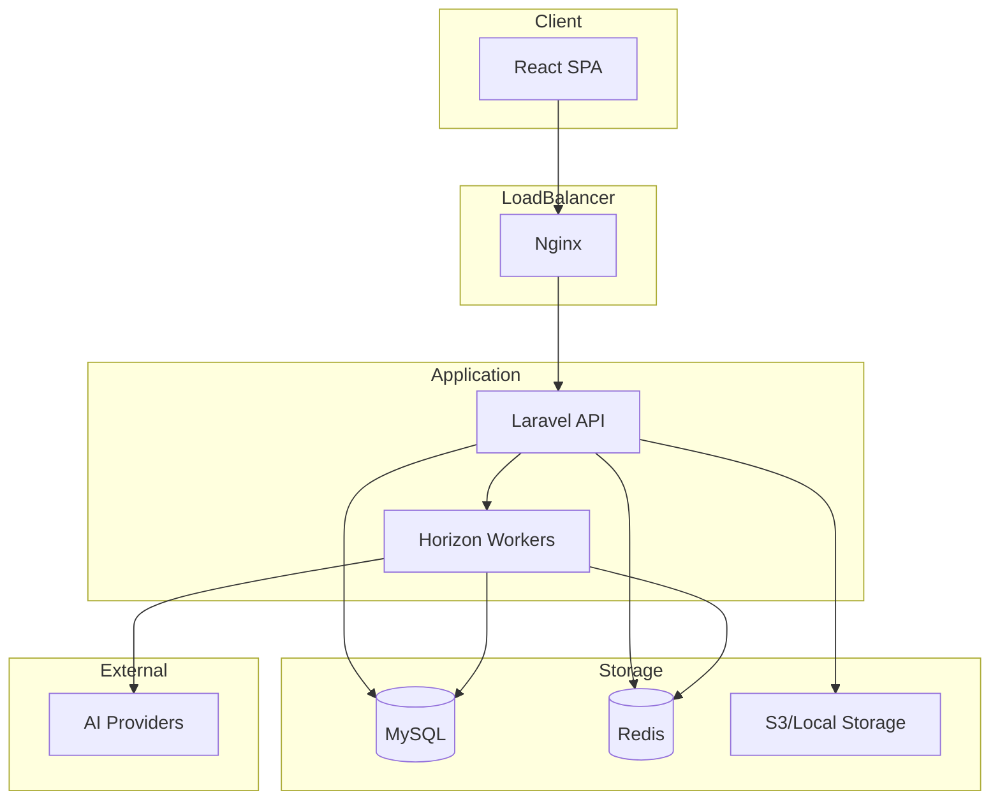
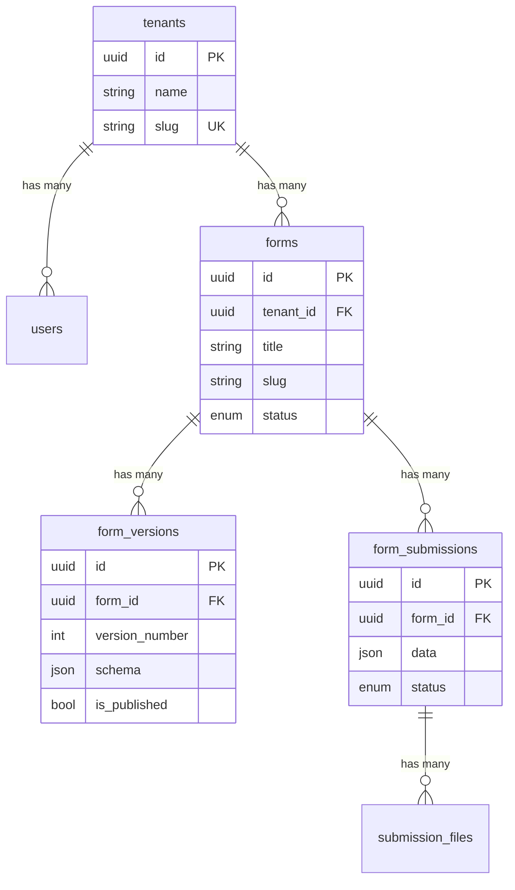

# AI Form Builder

> A multi-tenant form builder with AI-powered form generation, drag-and-drop editing, conditional logic, and document import capabilities.

---

## Live Demo

**Live URL:** https://ai-form-builder-2-gips.onrender.com

**Demo Credentials:**
- Email: `demo@example.com`
- Password: `password`

---

## 📋 Project Status

**Current Version:** 1.0.0

| Feature | Status |
|---------|--------|
| Form CRUD | ✅ Complete |
| Schema Validation | ✅ Complete |
| Form Publishing | ✅ Complete |
| Public Forms | ✅ Complete |
| Submissions | ✅ Complete |
| File Uploads | ✅ Complete |
| CSV Export | ✅ Complete |
| Conditional Logic | ✅ Complete |
| Form Versioning | ✅ Complete |
| AI Generation | ✅ Complete |
| AI Editing | ✅ Complete |
| DOCX Import | ✅ Complete |
| XLSX Import | ✅ Complete |
| Rate Limiting | ✅ Complete |
| Security Hardening | ✅ Complete |
| Multi-tenancy | ✅ Complete |

**Test Results:** 265 tests passed (622 assertions)

---

## ✨ Features

### Form Builder
- **14 Field Types:** text, textarea, number, email, phone, date, select, radio, checkbox_group, checkbox, file, heading, rating, URL
- **Drag & Drop:** Intuitive field reordering and section management
- **Real-time Preview:** Desktop and mobile preview modes
- **Autosave:** Debounced automatic saving with status indicator
- **JSON Editor:** Direct schema editing with validation

### AI-Powered Features
- **Form Generation:** Create forms from natural language descriptions
- **Form Editing:** Modify existing forms with AI instructions
- **Schema Repair:** Automatic fixing of invalid AI output
- **Multi-provider:** OpenAI, Anthropic, AWS Bedrock support

### Document Import
- **DOCX Import:** Parse Word documents into form schemas
- **XLSX Import:** Import from Excel with header or mapping format
- **Preview & Correct:** Review and adjust parsed fields before import
- **Deterministic Parsing:** Fast, predictable results without AI dependency

### Conditional Logic
- **Show/Hide Fields:** Based on other field values
- **Conditional Required:** Make fields required based on conditions
- **Section Skip:** Skip entire sections based on conditions
- **10 Operators:** equals, not_equals, contains, greater_than, etc.

### Security
- **Multi-tenant Isolation:** Complete data separation between organizations
- **Rate Limiting:** Protection against abuse
- **File Security:** Blocked dangerous extensions, MIME validation
- **Input Validation:** Schema size limits, field count limits
- **CSV Injection Prevention:** Escaped formula characters

---

##  Architecture

### System Overview



### Entity Relationship



---

##  Technology Stack

| Layer | Technology |
|-------|------------|
| Backend | PHP 8.2+, Laravel 12 |
| Frontend | React 18, TypeScript, Tailwind CSS 4 |
| Database | MySQL 8 / SQLite (dev) |
| Cache/Queue | Redis |
| Queue Worker | Laravel Horizon |
| Build Tool | Vite |
| Testing | PHPUnit, Vitest |

### Key Libraries

**Backend:**
- `laravel/sanctum` - API authentication
- `laravel/horizon` - Queue management
- `phpoffice/phpword` - DOCX parsing
- `phpoffice/phpspreadsheet` - XLSX parsing

**Frontend:**
- `@dnd-kit/core` - Drag and drop
- `@tanstack/react-query` - Data fetching
- `lucide-react` - Icons
- `axios` - HTTP client

---

##  Local Setup

### Prerequisites

- PHP 8.2+
- Composer
- Node.js 20+
- MySQL 8 or SQLite
- Redis

### Installation

```bash
# Clone repository
git clone <repository-url>
cd ai-form-builder

# Install PHP dependencies
composer install

# Install Node dependencies
npm install

# Configure environment
cp .env.example .env
php artisan key:generate

# Run migrations
php artisan migrate

# Seed demo data
php artisan db:seed

# Start development servers
php artisan serve        # Terminal 1
npm run dev              # Terminal 2
php artisan horizon      # Terminal 3
```

---

##  Docker Setup

```bash
# Start all services
docker-compose up -d --build

# Install dependencies
docker-compose exec app composer install

# Generate key and migrate
docker-compose exec app php artisan key:generate
docker-compose exec app php artisan migrate
docker-compose exec app php artisan db:seed

# Access application
open http://localhost:8000
```

### Docker Services

| Service | Port | Description |
|---------|------|-------------|
| nginx | 8000 | Web server |
| app | 9000 | PHP-FPM |
| mysql | 3306 | Database |
| redis | 6379 | Cache/Queue |
| horizon | - | Queue worker |
| node | 5173 | Vite dev server |

---

##  Environment Variables

### Required

```env
APP_KEY=                    # Generated by key:generate
DB_CONNECTION=mysql
DB_HOST=127.0.0.1
DB_DATABASE=ai_form_builder
DB_USERNAME=root
DB_PASSWORD=

REDIS_HOST=127.0.0.1
QUEUE_CONNECTION=redis
```

### AI Provider (Optional)

```env
AI_PROVIDER=openai          # openai, anthropic, bedrock
OPENAI_API_KEY=sk-...
OPENAI_MODEL=gpt-4

# Or for Anthropic
ANTHROPIC_API_KEY=sk-ant-...
ANTHROPIC_MODEL=claude-3-sonnet-20240229

# Or for AWS Bedrock
AWS_ACCESS_KEY_ID=
AWS_SECRET_ACCESS_KEY=
AWS_DEFAULT_REGION=us-east-1
BEDROCK_MODEL=anthropic.claude-3-sonnet-20240229-v1:0
```

---

##  Queue / Horizon

### Configuration

| Queue | Purpose | Timeout | Retries |
|-------|---------|---------|---------|
| default | General tasks | 60s | 3 |
| ai | AI generation/modification | 180s | 3 |
| imports | Document import processing | 300s | 3 |

All queues use exponential backoff (10s, 30s, 60s).

### Commands

```bash
# Start Horizon
php artisan horizon

# View status
php artisan horizon:status

# Pause/Continue
php artisan horizon:pause
php artisan horizon:continue
```

Access Horizon dashboard at `/horizon` (local only).

---

## Database

### Entity Relationship

```
tenants ─┬─< users
         ├─< forms ─┬─< form_versions
         │          └─< form_submissions ─< submission_files
         ├─< ai_jobs
         └─< import_jobs
```

### Important Indexes

| Table | Index | Purpose |
|-------|-------|---------|
| forms | tenant_id, updated_at | Form listing with ordering |
| forms | slug, status | Public form lookup |
| form_versions | form_id, version_number | Version history |
| form_versions | form_id, is_published | Published version lookup |
| form_submissions | form_id, ip_address, submitted_at | Duplicate detection |
| ai_jobs | tenant_id, user_id, created_at | User job listing |
| import_jobs | job_uuid, tenant_id | Job status lookup |

---

##  JSON Schema Contract

See [docs/SCHEMA.md](docs/SCHEMA.md) for complete specification.

### Example Schema

```json
{
  "schemaVersion": "1.0",
  "metadata": {
    "title": "Contact Form",
    "description": "Get in touch with us"
  },
  "settings": {
    "submitButtonText": "Send Message"
  },
  "sections": [
    {
      "id": "section_1",
      "title": "Contact Information",
      "fields": [
        {
          "id": "field_1",
          "key": "email",
          "type": "email",
          "label": "Email Address",
          "required": true
        }
      ]
    }
  ]
}
```

### Limits

| Constraint | Limit |
|------------|-------|
| Schema size | 1 MB |
| Fields per form | 200 |
| Sections per form | 50 |
| Options per field | 500 |

---

##  API Endpoints

### Authentication

| Method | Endpoint | Description |
|--------|----------|-------------|
| POST | /api/register | Register with tenant |
| POST | /api/login | Login |
| POST | /api/logout | Logout |
| GET | /api/user | Current user |
| POST | /api/tenants/{id}/switch | Switch tenant |

### Forms

| Method | Endpoint | Description |
|--------|----------|-------------|
| GET | /api/forms | List forms |
| POST | /api/forms | Create form |
| GET | /api/forms/{id} | Get form |
| PUT | /api/forms/{id} | Update form |
| DELETE | /api/forms/{id} | Delete form |
| PUT | /api/forms/{id}/schema | Update schema |
| POST | /api/forms/{id}/publish | Publish |
| POST | /api/forms/{id}/duplicate | Duplicate |

### Submissions

| Method | Endpoint | Description |
|--------|----------|-------------|
| GET | /api/forms/{id}/submissions | List submissions |
| GET | /api/forms/{id}/submissions/export | Export CSV |
| GET | /api/forms/{id}/submissions/{sid}/files/{fid} | Download file |

### AI

| Method | Endpoint | Description |
|--------|----------|-------------|
| POST | /api/ai/generate | Generate form |
| POST | /api/ai/forms/{id}/modify | Modify form |
| GET | /api/ai/jobs/{uuid} | Job status |
| POST | /api/ai/create-form | Create from job |

### Import

| Method | Endpoint | Description |
|--------|----------|-------------|
| POST | /api/import/upload | Upload document |
| GET | /api/import/{uuid} | Job status |
| GET | /api/import/{uuid}/preview | Preview elements |
| POST | /api/import/{uuid}/correct | Apply corrections |
| POST | /api/import/{uuid}/commit | Create form |

### Public

| Method | Endpoint | Description |
|--------|----------|-------------|
| GET | /api/public/forms/{slug} | Get published form |
| POST | /api/public/forms/{slug}/submit | Submit form |

---

##Security

### Rate Limits

| Action | Limit | Window |
|--------|-------|--------|
| Public submission | 10 | 1 min |
| Authentication | 5 | 1 min |
| AI generation | 5 | 1 min |
| AI modification | 10 | 1 min |
| Document import | 5 | 5 min |
| CSV export | 10 | 1 min |

### Security Headers

All responses include:
- `X-Content-Type-Options: nosniff`
- `X-Frame-Options: DENY`
- `X-XSS-Protection: 1; mode=block`
- `Referrer-Policy: strict-origin-when-cross-origin`

### File Upload Security

- Blocked: PHP, EXE, BAT, shell scripts, etc.
- Double extension detection
- MIME type validation
- Max size: 10MB
- Private storage with randomized paths

---

##  Testing

### Backend

```bash
# Run all tests
php artisan test

# Run specific suite
php artisan test --filter=Security
php artisan test --filter=AI
php artisan test --filter=Import
```

### Frontend

```bash
npm run test
```

### Test Coverage

| Category | Tests |
|----------|-------|
| Authentication | 6 |
| Tenant Isolation | 10 |
| Form CRUD | 20 |
| Publishing | 17 |
| Submissions | 21 |
| Versioning | 18 |
| Conditional Logic | 22 |
| AI Generation | 29 |
| Document Import | 24 |
| Security | 30 |
| Schema Validation | 28 |
| **Total** | **265** |

---

##  Deployment

### Production Checklist

- [ ] Set `APP_ENV=production`
- [ ] Set `APP_DEBUG=false`
- [ ] Configure production database
- [ ] Configure Redis
- [ ] Set up Horizon supervisor
- [ ] Configure file storage (S3 recommended)
- [ ] Set up SSL/TLS
- [ ] Configure rate limiting
- [ ] Set up monitoring

### Environment Security

- `.env` is in `.gitignore`
- No secrets in repository
- Use environment variables for all credentials

---

##  Limitations

1. **No real-time collaboration** - Single user editing only
2. **No form templates** - Must create from scratch or import
3. **No file preview** - Files must be downloaded to view
4. **No analytics dashboard** - Basic submission listing only
5. **No i18n** - English only
6. **No webhooks** - No submission notifications

---

##  Documentation

- [Schema Specification](docs/SCHEMA.md)
- [Architecture Decisions](docs/DECISIONS.md)

---

## License

Proprietary - All rights reserved.
