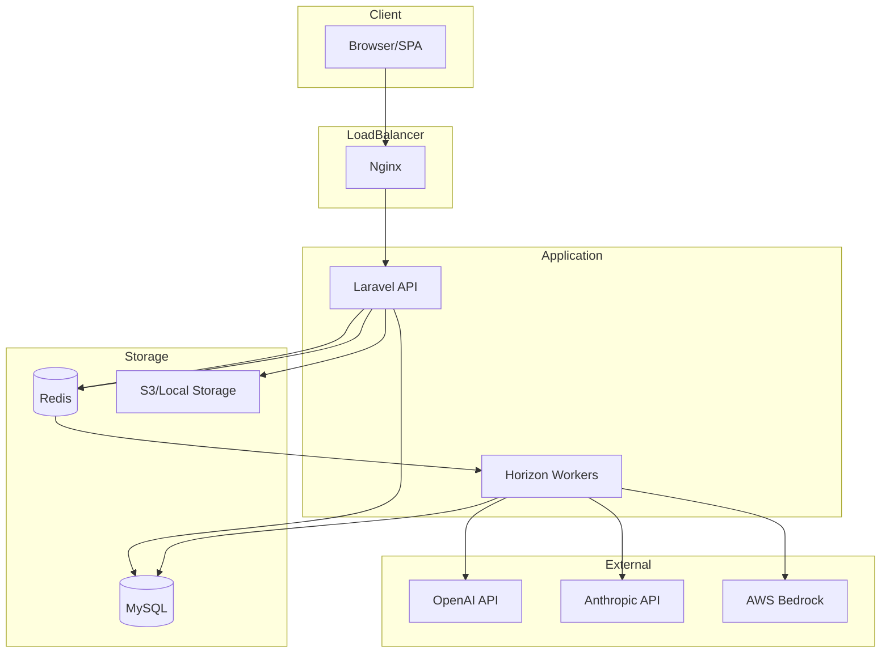
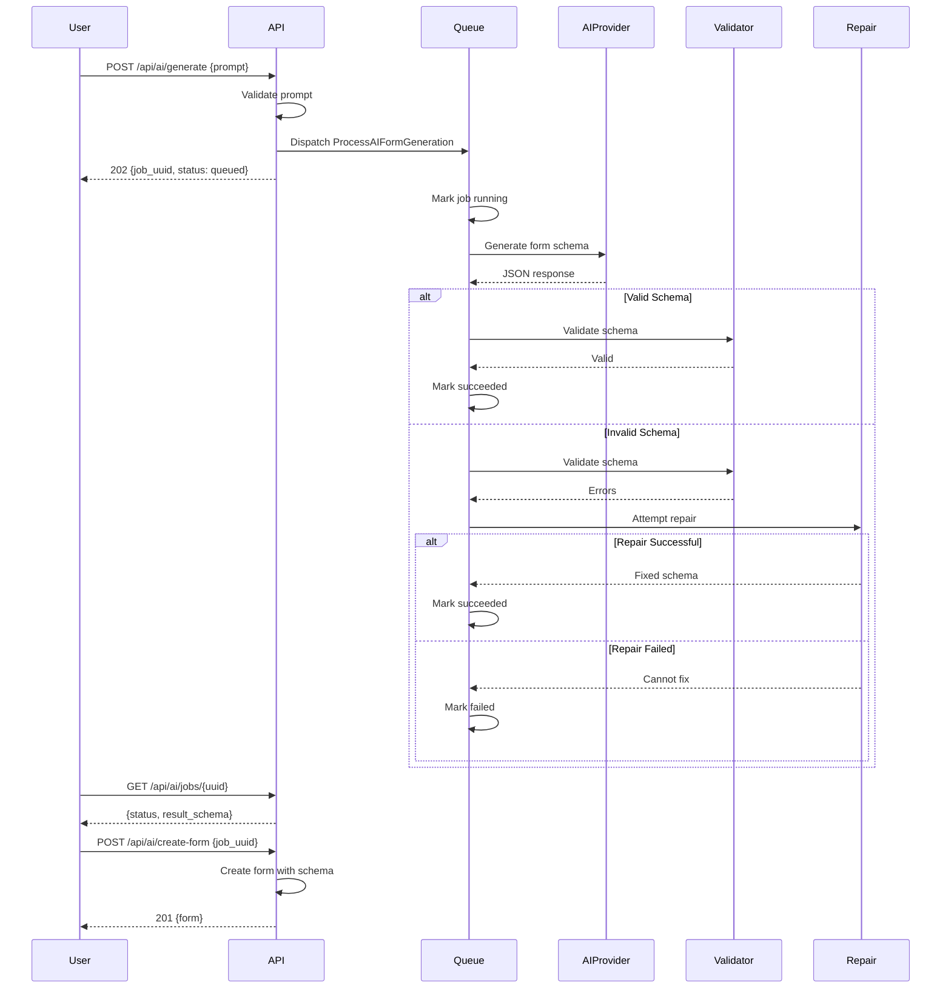
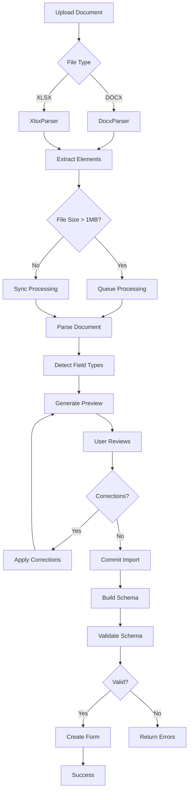

# Architecture Decisions

## Overview

This document captures the key architectural decisions made during the development of the AI Form Builder application.

---

## ADR-001: Form Schema as Single Source of Truth

**Date:** 2024-01-02  
**Status:** Accepted

### Context

The form builder needs a consistent way to define form structure that works across:
- Backend validation and storage
- Frontend rendering and editing
- AI-generated form creation
- Form submission processing

### Decision

The JSON schema stored in `form_versions.schema` is the **single source of truth** for form structure. All components (backend, frontend, AI) must conform to this schema contract defined in `FormSchemaContract.php`.

### Consequences

- Schema validation happens server-side before persistence
- Frontend TypeScript types mirror backend contract
- Invalid schemas are never persisted
- Schema changes require version bumps

---

## ADR-002: Immutable Form Versions

**Date:** 2024-01-02  
**Status:** Accepted

### Context

Forms need version history for:
- Audit trails
- Rollback capability
- Submission integrity (submissions reference specific versions)

### Decision

Published form versions are immutable. Editing a form creates a new version. Historical versions are never modified.

### Consequences

- `form_versions.is_published` marks immutable versions
- Editing creates new version with incremented `version_number`
- Submissions reference specific version IDs
- Storage grows with each edit (acceptable trade-off)

---

## ADR-003: Schema Versioning Strategy

**Date:** 2024-01-02  
**Status:** Accepted

### Context

The schema format may evolve over time. We need a strategy for handling schema changes.

### Decision

- Schema version follows semver: `MAJOR.MINOR`
- Current version: `1.0`
- Major version bump: Breaking changes requiring migration
- Minor version bump: Backward-compatible additions
- Schema version stored in `form_versions.schema_version`

### Consequences

- Old schemas remain valid until explicitly migrated
- Migration scripts needed for major version changes
- Frontend must handle multiple schema versions during transition

---

## ADR-004: Field Identification Strategy

**Date:** 2024-01-02  
**Status:** Accepted

### Context

Fields need stable identifiers for:
- Conditional logic references
- Submission data mapping
- Analytics and reporting

### Decision

Each field has two identifiers:
- `id`: UUID-style unique identifier (e.g., `field_abc123`), used for internal references
- `key`: Machine-readable key (e.g., `email_address`), used for submission data

### Consequences

- `id` is auto-generated and immutable
- `key` is user-editable but must be unique within form
- Submissions use `key` for data storage
- Conditions reference fields by `id`

---

## ADR-005: Multi-Tenant Architecture

**Date:** 2024-01-02  
**Status:** Accepted

### Context

The application must support multiple organizations with complete data isolation.

### Decision

- `BelongsToTenant` trait with global scope for automatic filtering
- `TenantService` manages current tenant context
- Middleware chain: `SetTenantContext` → `EnsureTenantContext`
- All tenant-owned models include `tenant_id` foreign key

### Consequences

- No cross-tenant data access possible
- Tenant context required for all operations
- Performance: `tenant_id` indexed on all tables
- Users can belong to multiple tenants with role-based access

---

## ADR-006: AI Provider Abstraction

**Date:** 2024-01-05  
**Status:** Accepted

### Context

AI form generation should support multiple providers (OpenAI, Anthropic, AWS Bedrock) without code changes.

### Decision

- `FormAIProvider` interface defines contract
- Provider implementations: `OpenAIProvider`, `AnthropicProvider`, `BedrockProvider`
- `AIServiceProvider` registers provider based on `AI_PROVIDER` env var
- `AISchemaRepair` attempts to fix invalid AI output before failing

### Alternatives Considered

1. **Direct API calls**: Rejected - no flexibility for provider switching
2. **LangChain**: Rejected - too heavy for our use case
3. **Custom abstraction**: Accepted - minimal overhead, full control

### Consequences

- Easy to add new providers
- Consistent error handling across providers
- Schema repair reduces AI failure rate
- Provider-specific features may require interface extensions

---

## ADR-007: Deterministic Parsing vs AI for Document Import

**Date:** 2024-01-06  
**Status:** Accepted

### Context

Document import (DOCX/XLSX) needs to extract form fields. Options:
1. Pure AI classification
2. Pure deterministic parsing
3. Hybrid approach

### Decision

**Deterministic parsing first, AI only for ambiguity resolution.**

- `DocxParser`: Pattern matching for headings, questions, lists, tables
- `XlsxParser`: Header row detection, explicit mapping format support
- AI classification available as opt-in for ambiguous cases
- User correction step before final import

### Rationale

- Deterministic parsing is faster and cheaper
- Results are predictable and debuggable
- AI adds latency and cost
- User correction handles edge cases

### Consequences

- Import preview shows parsed elements for review
- Users can correct field types before commit
- AI classification is optional enhancement
- Complex documents may need more manual correction

---

## ADR-008: Conditional Logic Evaluation

**Date:** 2024-01-04  
**Status:** Accepted

### Context

Forms need conditional logic for:
- Show/hide fields based on other field values
- Conditional required validation
- Section skip logic

### Decision

- Conditions stored in field schema as `conditions` array
- `ConditionEvaluator` service evaluates conditions at runtime
- Supported operators: `equals`, `not_equals`, `contains`, `greater_than`, `less_than`, `is_empty`, `is_not_empty`, `in`, `not_in`
- Supported actions: `show`, `hide`, `require`, `disable`

### Validation Rules

- No self-referencing conditions
- Referenced fields must exist
- No circular dependencies
- Operators must be compatible with field types

### Consequences

- Server-side validation respects conditions
- Hidden required fields don't fail validation
- Frontend must implement same evaluation logic
- Complex conditions may impact form performance

---

## ADR-009: File Upload Security

**Date:** 2024-01-07  
**Status:** Accepted

### Context

File uploads present security risks including:
- Malicious file execution
- Path traversal attacks
- Storage exhaustion

### Decision

- `FileSecurityService` validates all uploads
- Blocked extensions: PHP, EXE, BAT, shell scripts, etc.
- Double extension detection (e.g., `file.php.jpg`)
- MIME type validation
- Files stored in private storage with non-guessable paths
- Download requires authentication and form ownership

### Consequences

- Some legitimate files may be blocked
- Storage paths are randomized (harder to debug)
- Download URLs are not shareable
- File access is auditable

---

## ADR-010: Rate Limiting Strategy

**Date:** 2024-01-07  
**Status:** Accepted

### Context

API endpoints need protection against abuse without impacting legitimate users.

### Decision

Rate limits by action type:

| Action | Limit | Window |
|--------|-------|--------|
| Public submission | 10 | 1 min |
| Authentication | 5 | 1 min |
| AI generation | 5 | 1 min |
| AI modification | 10 | 1 min |
| Document import | 5 | 5 min |
| CSV export | 10 | 1 min |

### Implementation

- `RateLimitByAction` middleware
- Redis-backed rate limiter
- Rate limit headers in responses
- 429 response with `Retry-After` header

### Consequences

- Legitimate users rarely hit limits
- Abuse is effectively blocked
- Rate limits are per-user for authenticated routes
- Rate limits are per-IP for public routes

---

## ADR-011: Queue Architecture

**Date:** 2024-01-07  
**Status:** Accepted

### Context

Long-running tasks (AI generation, document import) should not block HTTP requests.

### Decision

- Laravel Horizon for queue management
- Three dedicated queues: `default`, `ai`, `imports`
- Exponential backoff: 10s, 30s, 60s
- Idempotency checks in job handlers
- Job status tracked in database

### Queue Configuration

| Queue | Timeout | Retries | Workers |
|-------|---------|---------|---------|
| default | 60s | 3 | 3-10 |
| ai | 180s | 3 | 2-5 |
| imports | 300s | 3 | 2-3 |

### Consequences

- Long tasks don't timeout HTTP requests
- Failed jobs are retried automatically
- Job status is queryable via API
- Horizon dashboard for monitoring

---

## ADR-012: Laravel + React Integration

**Date:** 2024-01-01  
**Status:** Accepted

### Context

Need to integrate React frontend with Laravel backend.

### Decision

- Vite for frontend build
- Laravel serves API endpoints under `/api`
- React SPA served from Laravel blade template
- Sanctum for API authentication

### Alternatives Considered

1. **Separate frontend deployment**: Rejected - adds complexity
2. **Inertia.js**: Rejected - less flexibility for complex UI
3. **Livewire**: Rejected - not suitable for drag-drop builder

### Consequences

- Single deployment artifact
- Shared session/CSRF handling
- API-first architecture
- Frontend can be extracted later if needed

---

## Trade-offs and Limitations

### Current Limitations

1. **No real-time collaboration**: Forms can only be edited by one user at a time
2. **No form templates**: Users must create forms from scratch or import
3. **Limited file preview**: No in-browser preview for uploaded files
4. **No form analytics**: No built-in submission analytics dashboard
5. **Single language**: No i18n support for form labels

### Accepted Trade-offs

1. **Storage vs. Performance**: Immutable versions increase storage but simplify logic
2. **Security vs. Convenience**: Strict file validation may block some legitimate files
3. **Simplicity vs. Features**: Deterministic parsing over AI for predictability
4. **Consistency vs. Flexibility**: Strict schema validation over permissive parsing

---

## Two-Week Improvement Plan

### Week 1: Core Enhancements

1. **Form Templates** (2 days)
   - Pre-built templates for common use cases
   - Template gallery UI
   - Template customization

2. **Form Analytics** (2 days)
   - Submission counts and trends
   - Field completion rates
   - Drop-off analysis

3. **Bulk Operations** (1 day)
   - Bulk delete submissions
   - Bulk export with filters

### Week 2: Advanced Features

4. **Real-time Collaboration** (3 days)
   - WebSocket integration
   - Presence indicators
   - Conflict resolution

5. **Advanced Conditional Logic** (2 days)
   - AND/OR condition groups
   - Calculated fields
   - Field value transformations

6. **Performance Optimization** (2 days)
   - Query optimization
   - Caching layer
   - CDN for static assets

---

## Diagrams

### Entity Relationship Diagram

```mermaid
erDiagram
    tenants ||--o{ users : "has many"
    tenants ||--o{ forms : "has many"
    users ||--o{ forms : "creates"
    forms ||--o{ form_versions : "has many"
    forms ||--o{ form_submissions : "has many"
    form_versions ||--o{ form_submissions : "receives"
    form_submissions ||--o{ submission_files : "has many"
    tenants ||--o{ ai_jobs : "has many"
    tenants ||--o{ import_jobs : "has many"
    users ||--o{ ai_jobs : "creates"
    users ||--o{ import_jobs : "creates"

    tenants {
        bigint id PK
        string name
        string slug UK
        timestamps
    }

    users {
        bigint id PK
        string name
        string email UK
        string password
        bigint current_tenant_id FK
        timestamps
    }

    forms {
        bigint id PK
        bigint tenant_id FK
        bigint created_by FK
        string title
        text description
        string slug UK
        enum status
        text success_message
        json settings
        bigint current_version_id FK
        timestamps
    }

    form_versions {
        bigint id PK
        bigint form_id FK
        bigint created_by FK
        int version_number
        string schema_version
        json schema
        string change_type
        boolean is_published
        timestamp published_at
        timestamps
    }

    form_submissions {
        bigint id PK
        bigint form_id FK
        bigint form_version_id FK
        json data
        string status
        string submission_token UK
        string ip_address
        string user_agent
        timestamp submitted_at
        timestamps
    }

    submission_files {
        bigint id PK
        bigint form_submission_id FK
        string field_key
        string original_name
        string stored_name
        string path
        string mime_type
        int size
        string disk
        timestamps
    }

    ai_jobs {
        bigint id PK
        bigint tenant_id FK
        bigint user_id FK
        bigint form_id FK
        uuid job_uuid UK
        string request_type
        string status
        string provider
        string model
        text prompt
        json options
        json result_schema
        json validation_errors
        json repair_log
        int input_tokens
        int output_tokens
        int latency_ms
        string error_type
        text error_message
        timestamps
    }

    import_jobs {
        bigint id PK
        bigint tenant_id FK
        bigint user_id FK
        bigint form_id FK
        uuid job_uuid UK
        string import_type
        string status
        string original_filename
        string file_path
        int file_size
        json parsed_elements
        json corrected_elements
        json result_schema
        text error_message
        timestamps
    }
```

### Architecture Diagram



### AI Generation Sequence Diagram



### Import Flow Diagram


